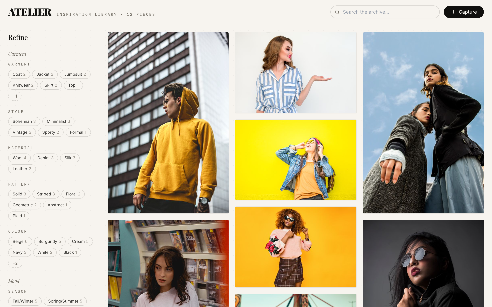
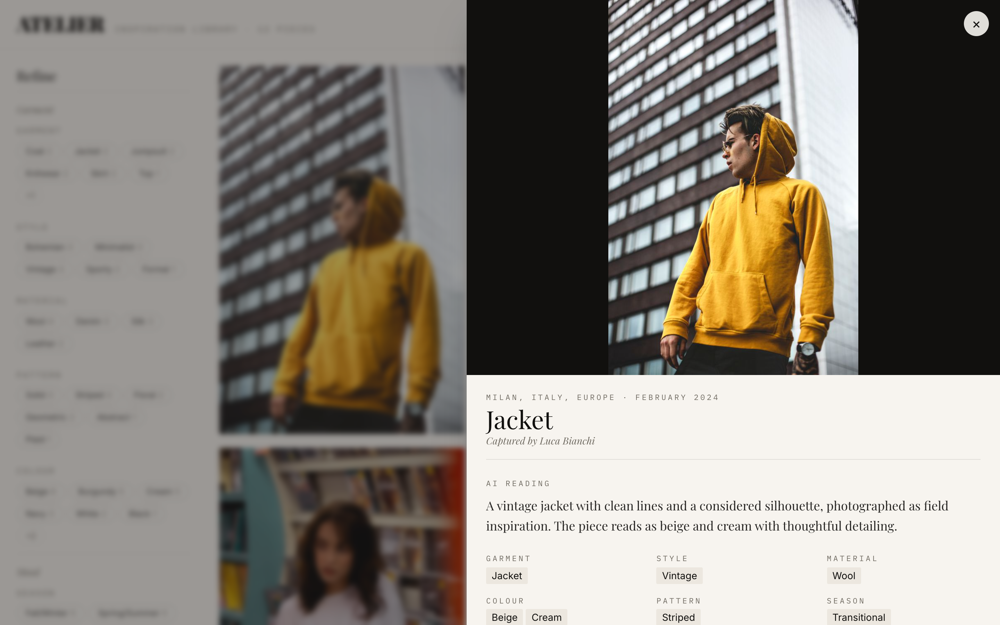
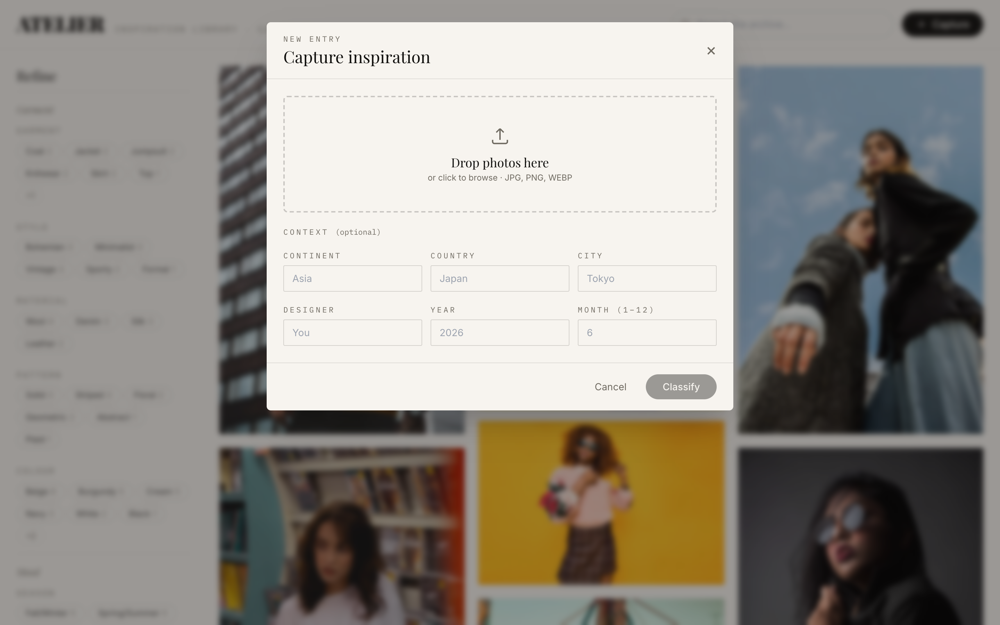

# Atelier

A small web app for fashion designers who collect inspiration photos in the
field and then can't find anything later. You upload a garment photo, a vision
model writes a description and tags it (type, style, material, colours, pattern,
season, occasion, consumer, trend), and the whole thing becomes a searchable,
filterable archive you can annotate. It's laid out like a lookbook rather than a
spreadsheet, because the people using it think in images.



## Running it

You need Docker running. Then:

```bash
./setup.sh
```

It asks whether you want to use Claude (paste an Anthropic key) or just poke
around offline, writes your `.env`, builds the containers, waits for the backend
to come up, and tells you where to go. That's the whole setup — one command.

Then open http://localhost:3000.

If you just want to see the UI without a key, there's an offline mode that fakes
the classifier so everything (upload, grid, filters, search, notes) still works:

```bash
./setup.sh --demo
```

A couple of other shortcuts:

```bash
./setup.sh --key sk-ant-...   # skip the prompt, use this key
./setup.sh --down             # stop everything
```

One caveat on `--demo`: the fake classifier produces *consistent but made-up*
attributes. It's there so you can try the product, not to judge model quality.
For that, use a real key.

| | |
| --- | --- |
|  |  |

## What's in here

Three things the app does, and roughly how:

**Upload and classify.** You can drop in one photo or a dozen, optionally
tagging them with where/when you shot them and who shot them. Each one gets sent
to a multimodal model that returns a paragraph of description plus a JSON blob of
attributes; both get stored. The classify step runs in the background so the
upload returns immediately and the grid fills in as images finish.

**Search and filter.** The library is a masonry grid. The filters down the left
are built from whatever's actually in your data — if nothing's tagged
"bohemian", there's no bohemian filter — and they're sorted by how common each
value is. You can filter on the garment attributes and on context (continent /
country / city, year / month / season, designer). Search is full-text over the
descriptions, so "embroidered neckline" or "artisan market" work the way you'd
hope.

**Annotations.** You can add your own tags and notes to anything. They show up in
their own accent-coloured block so it's obvious what's your read versus the
model's, and they're folded into the search index — a note that says
"embroidered" will surface that image even if the model never used the word.

## How it's built

```
app/
  backend/         FastAPI + SQLite (with FTS5 for search)
    main.py          app wiring, CORS, health check
    database.py      schema, the full-text index, reindex helper
    parser.py        turns messy model text into clean attributes  (unit-tested)
    query.py         builds the filter/search SQL from query params (integration-tested)
    classifier.py    image -> provider -> parser
    providers/       claude / openai / ollama / stub, behind one interface
    routes/          images, filters, search, annotations
  frontend/        React + Vite + TypeScript + Tailwind
    src/             the editorial UI — grid, filter rail, detail drawer
eval/              the accuracy harness + 50 labelled test images
tests/             pytest: unit, integration, end-to-end
```

A few decisions worth explaining:

I used **SQLite with FTS5** instead of reaching for Postgres + a search engine.
For a local single-user POC it's one file, no services to run, and FTS5 gives
full-text search for free. If this ever grew up the data layer is small enough
to swap.

Attributes are stored as **flat columns**, and the list-ish ones (colours,
styles) as comma-separated strings that get matched as substrings and split back
out when building filter options. A proper normalized tag schema would be
cleaner, but this was the right amount of structure for a one-day build.

The **providers sit behind a tiny interface** so Claude, OpenAI, and a local
Ollama model are interchangeable, and there's a deterministic **stub** that lets
the app and the entire test suite run with no key and no network. If you point it
at a provider but forget the key, it falls back to the stub rather than crashing.

There's **one prompt** asking for `DESCRIPTION:` then `ATTRIBUTES: {json}`, and a
deliberately forgiving **parser** behind it, because models don't always do as
they're told — it copes with code fences, missing labels, broken JSON, nested
braces, and list values, and always hands back the same shape. That parser is the
single most-tested piece of the backend.

### Running it without Docker

```bash
# backend
cd app/backend
python -m venv .venv && source .venv/bin/activate
pip install -r requirements.txt
FASHION_AI_STUB=1 uvicorn main:app --reload --port 8000   # or export ANTHROPIC_API_KEY

# frontend, in another terminal
cd app/frontend
npm install && npm run dev      # http://localhost:5173, proxies /api to :8000
```

## How well does the model do?

I labelled 50 garment photos from [Pexels](https://www.pexels.com/search/fashion/)
(free licence) by hand — actually looking at each one and writing down the
expected garment type, style, material, pattern, season, occasion, colours, and a
note about the visible setting. Those labels are in `eval/labels.json`. Where a
field is genuinely a toss-up the label allows alternatives (`jacket|coat`), any
of which counts.

To reproduce:

```bash
cd eval
python download_images.py     # pull the 50 images
python eval_runner.py         # classify all 50 and write report.md
```

The harness imports the app's own classifier and parser, so it's measuring the
same thing the product runs. Scoring is intentionally lenient, because fashion
attributes are fuzzy and exact string match would punish correct answers:
categorical fields match on containment (so "winter" counts for "fall/winter"),
colours are scored on whether the model recovered the colours I labelled (a
correct `black, charcoal, gold` shouldn't lose to a label of just `black`), and
location is checked against the model's free-text description since it isn't
asked to name a place.

Here's a real run against `claude-sonnet-4-6` (the full report is in
`eval/report.md`):

| Attribute | Accuracy |
| --- | --- |
| style | 92% |
| pattern | 88% |
| occasion | 88% |
| material | 82% |
| garment_type | 72% |
| season | 72% |
| color_palette | 100% |
| location_context | 38% |
| **overall** | **~79%** |

Numbers wobble a few points run to run because the model is non-deterministic.

**Where it's strong.** Style, pattern, and occasion are reliably good — these are
either directly visible or follow from the overall look, and the model reads them
the way a person would. Colour is essentially solved once you score it sensibly:
it always caught the colours I labelled, usually with extra shades I hadn't
bothered to write down.

**Where it slips.** Garment type and season both land around 72%, and digging
into the misses, most aren't really wrong — they're disagreements on genuinely
ambiguous images. A knit top labelled `knitwear` comes back as `top`; a Nike
running tee labelled `top` comes back as `activewear`; a mid-weight outfit I
called `transitional` reads as `spring/summer`. Reasonable either way. Material
(82%) is better than I expected given you're guessing fabric from pixels, but it's
the one with a real ceiling — cotton vs. linen vs. a cotton-poly blend is often
not decidable from a photo.

**Location (38%) is the honest low point**, and it's partly the task design: when
the photo is shot on a plain studio backdrop the model describes the garment and
never says "studio", so there's nothing for the matcher to catch. It's also the
least important attribute here, since in the real product location is something
the designer enters at upload time, not something we need the model to guess.

**What I'd do with more time:** put a few labelled examples in the prompt to pin
down the ambiguous categories, and switch the structured output to tool/function
calling with a fixed vocabulary so the model can't drift and the parser has less
to forgive. Beyond that, a bigger and more geographically varied test set, and
CLIP embeddings to enable visual "find more like this" — which is probably the
feature a designer would actually want next.

## Tests

```bash
pip install -r app/backend/requirements.txt pytest
python -m pytest tests/ -v
```

22 tests, all offline (stub provider, throwaway database — no key, no network):

- **`test_parser.py`** — the unit tests, on turning model output into structured
  attributes: clean input, code fences, broken JSON, missing labels, list values,
  nested braces, empty strings.
- **`test_filters.py`** — integration tests for filtering, leaning hard on the
  location and time cases the brief calls out: country, continent+city together,
  year and month, OR-within-a-field, substring matching on list columns, search
  across both descriptions and annotations, and the dynamic filter endpoint.
- **`test_e2e.py`** — the full path over HTTP: upload → classify → filter, plus
  annotation search, deletion cleanup, and rejecting non-images.

## Known limitations

It's a one-day POC, so:

- One shared archive, no accounts.
- Material is a best-effort guess and sometimes wrong — see above.
- Location/time are entered by hand; nothing reads EXIF yet.
- No pagination — fine for hundreds of images, not millions.
- Demo mode is for the UX only; it doesn't reflect real model quality.
- No visual similarity search yet. That's the first thing I'd add.

The core loop — upload, classify, search and filter, annotate — is complete and
tested end to end. Anything I'd have done with more time is called out above
rather than left as a surprise.
